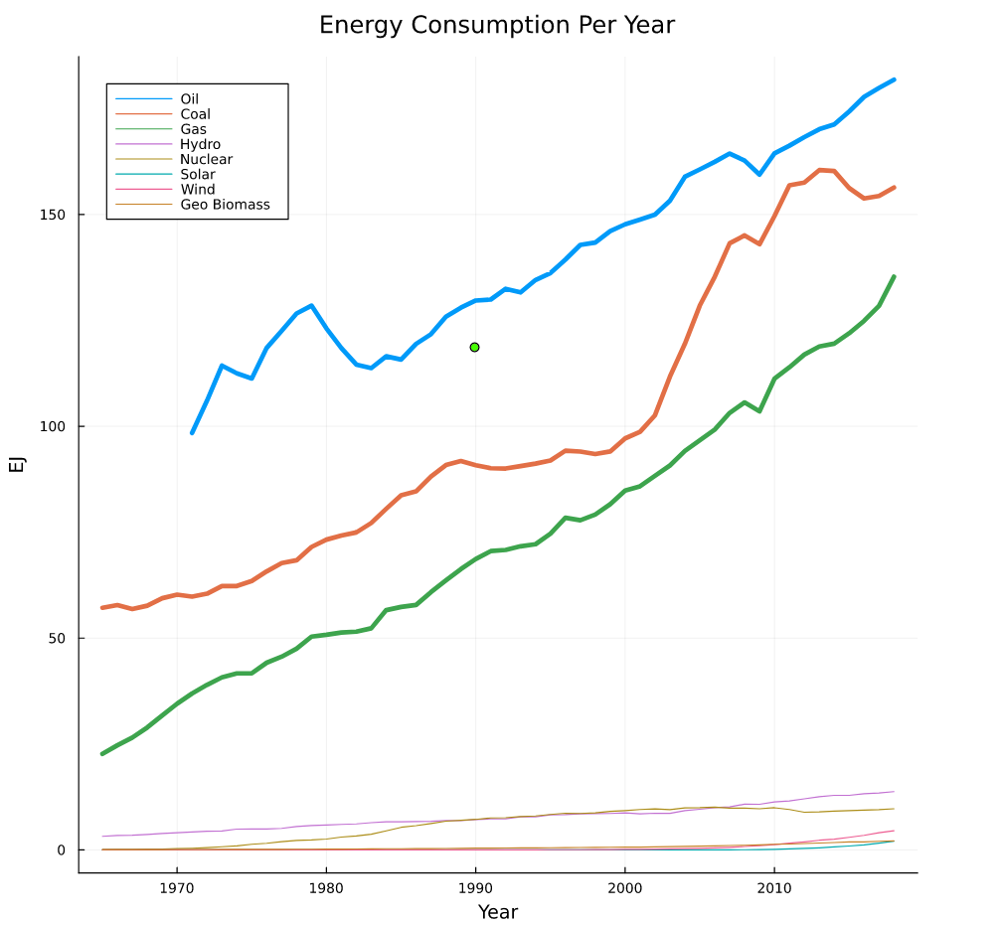
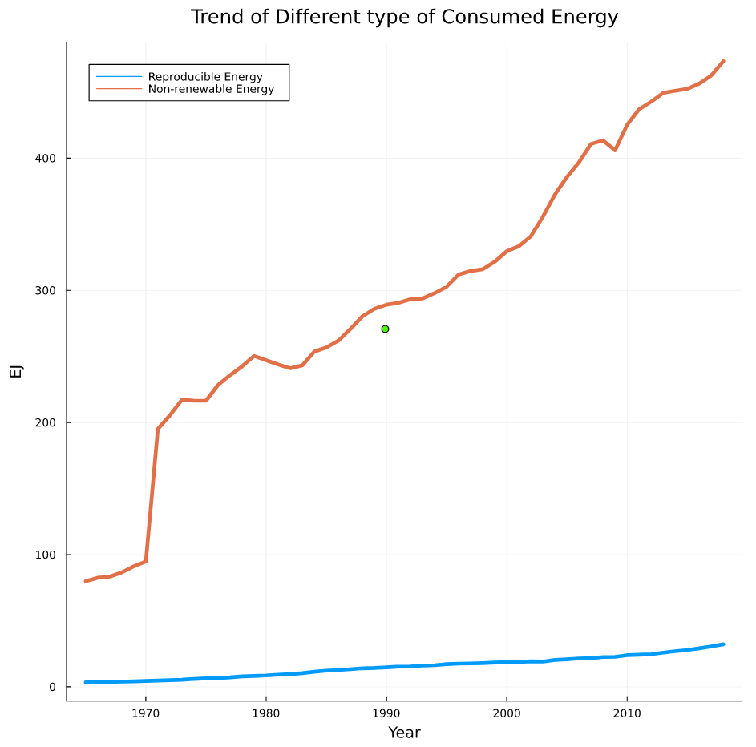
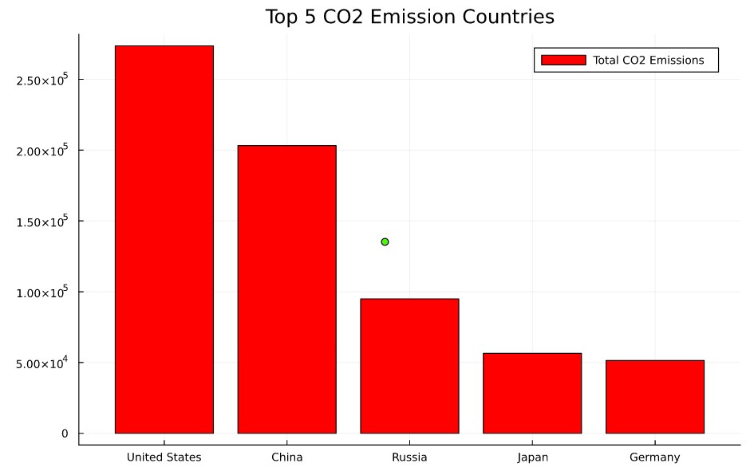

---
title: CEE 492 Team Uhhh Project
keywords:
- markdown
- publishing
- manubot
lang: en-US
date-meta: '2022-12-09'
author-meta:
- Robert Joseph Wiggins
- YongjianMa
- Muhammad
header-includes: |-
  <!--
  Manubot generated metadata rendered from header-includes-template.html.
  Suggest improvements at https://github.com/manubot/manubot/blob/main/manubot/process/header-includes-template.html
  -->
  <meta name="dc.format" content="text/html" />
  <meta name="dc.title" content="CEE 492 Team Uhhh Project" />
  <meta name="citation_title" content="CEE 492 Team Uhhh Project" />
  <meta property="og:title" content="CEE 492 Team Uhhh Project" />
  <meta property="twitter:title" content="CEE 492 Team Uhhh Project" />
  <meta name="dc.date" content="2022-12-09" />
  <meta name="citation_publication_date" content="2022-12-09" />
  <meta name="dc.language" content="en-US" />
  <meta name="citation_language" content="en-US" />
  <meta name="dc.relation.ispartof" content="Manubot" />
  <meta name="dc.publisher" content="Manubot" />
  <meta name="citation_journal_title" content="Manubot" />
  <meta name="citation_technical_report_institution" content="Manubot" />
  <meta name="citation_author" content="Robert Joseph Wiggins" />
  <meta name="citation_author_institution" content="Department of Civil and Environmental Engineering, University of Illinois Urbana-Champaign" />
  <meta name="citation_author_orcid" content="XXXX-XXXX-XXXX-XXXX" />
  <meta name="twitter:creator" content="@bobbythewiggler" />
  <meta name="citation_author" content="YongjianMa" />
  <meta name="citation_author_institution" content="Department of Civil and Environmental Engineering, University of Illinois at Urbana-Champaign" />
  <meta name="citation_author_orcid" content="0000-0001-8374-9401" />
  <meta name="citation_author" content="Muhammad" />
  <meta name="citation_author_institution" content="Department of Civil and Environmental Engineering, University of Illinois Urbana-Champaign" />
  <meta name="citation_author_orcid" content="XXXX-XXXX-XXXX-XXXX" />
  <link rel="canonical" href="https://uiceds.github.io/cee-492-term-project-fall-2022-team-uhhh/" />
  <meta property="og:url" content="https://uiceds.github.io/cee-492-term-project-fall-2022-team-uhhh/" />
  <meta property="twitter:url" content="https://uiceds.github.io/cee-492-term-project-fall-2022-team-uhhh/" />
  <meta name="citation_fulltext_html_url" content="https://uiceds.github.io/cee-492-term-project-fall-2022-team-uhhh/" />
  <meta name="citation_pdf_url" content="https://uiceds.github.io/cee-492-term-project-fall-2022-team-uhhh/manuscript.pdf" />
  <link rel="alternate" type="application/pdf" href="https://uiceds.github.io/cee-492-term-project-fall-2022-team-uhhh/manuscript.pdf" />
  <link rel="alternate" type="text/html" href="https://uiceds.github.io/cee-492-term-project-fall-2022-team-uhhh/v/50bfb260eb644cfd0e66fabdee144891e05e6d88/" />
  <meta name="manubot_html_url_versioned" content="https://uiceds.github.io/cee-492-term-project-fall-2022-team-uhhh/v/50bfb260eb644cfd0e66fabdee144891e05e6d88/" />
  <meta name="manubot_pdf_url_versioned" content="https://uiceds.github.io/cee-492-term-project-fall-2022-team-uhhh/v/50bfb260eb644cfd0e66fabdee144891e05e6d88/manuscript.pdf" />
  <meta property="og:type" content="article" />
  <meta property="twitter:card" content="summary_large_image" />
  <link rel="icon" type="image/png" sizes="192x192" href="https://manubot.org/favicon-192x192.png" />
  <link rel="mask-icon" href="https://manubot.org/safari-pinned-tab.svg" color="#ad1457" />
  <meta name="theme-color" content="#ad1457" />
  <!-- end Manubot generated metadata -->
bibliography: []
manubot-output-bibliography: output/references.json
manubot-output-citekeys: output/citations.tsv
manubot-requests-cache-path: ci/cache/requests-cache
manubot-clear-requests-cache: false
...

<small><em>
This manuscript
([permalink](https://uiceds.github.io/cee-492-term-project-fall-2022-team-uhhh/v/50bfb260eb644cfd0e66fabdee144891e05e6d88/))
was automatically generated
from [uiceds/cee-492-term-project-fall-2022-team-uhhh@50bfb26](https://github.com/uiceds/cee-492-term-project-fall-2022-team-uhhh/tree/50bfb260eb644cfd0e66fabdee144891e05e6d88)
on December 9, 2022.
</em></small>

## Authors

+ **Robert Joseph Wiggins** 
    {.inline_icon}
    [XXXX-XXXX-XXXX-XXXX](https://orcid.org/XXXX-XXXX-XXXX-XXXX)
    · {.inline_icon}
    [BobbyWiggles](https://github.com/BobbyWiggles)
    · {.inline_icon}
    [bobbythewiggler](https://twitter.com/bobbythewiggler) 
  <small>
     Department of Civil and Environmental Engineering, University of Illinois Urbana-Champaign
  </small>

+ **YongjianMa** 
    {.inline_icon}
    [0000-0001-8374-9401](https://orcid.org/0000-0001-8374-9401)
    · {.inline_icon}
    [YongjianMa](https://github.com/YongjianMa) 
  <small>
     Department of Civil and Environmental Engineering, University of Illinois at Urbana-Champaign
  </small>

+ **Muhammad** 
    {.inline_icon}
    [XXXX-XXXX-XXXX-XXXX](https://orcid.org/XXXX-XXXX-XXXX-XXXX)
    · {.inline_icon}
    [hanzla07](https://github.com/hanzla07) 
  <small>
     Department of Civil and Environmental Engineering, University of Illinois Urbana-Champaign
  </small>

## Effects of Energy Consumption Industries on Carbon Emissions by Country {.page_break_before}

Written by: Yongjian Ma, Muhammad Hanzla Rafaqat, Robert Wiggins

Description:

The datasets of interest are housed within a collection of datasets titled “Compiled Datasets for CDP Analytics Competition.” The dataset was published to Kaggle by user “seraphimstreets.” and features data collected and cited from several reputable organizations, such as Organization for Economic Co-operation Development, The Institute for Health metrics and Evaluation, and The World Resource Institute. 

The first dataset in question is titled “Percent of Energy Consumption by Country.” The dataset is a CSV file containing 11 columns of data. The first three columns include the country and year the data in each row was obtained from, as well as the corresponding country codes. The next eight columns list the percentages of each industry’s energy consumption within each country in a given year. The industries recorded include coal, gas, oil, hydroelectric, nuclear, solar, wind, and biomass.

The second dataset in question is titled “CO2 Emissions by Country.” The dataset is also a CSV file containing 4 columns of data. The first three columns again include the country and year the data in each row was obtained from, as well as the corresponding country codes. The last column lists the CO2 emissions from each country in a given year.

Proposal:

With the increasing amount of CO2 emissions worldwide and the difficulty of establishing meaningful efforts to combat the increasing climate crisis, it is integral to pinpoint the major contributors to climate change and work to lower the CO2 emissions produced by these contributors as much as possible. With the dataset collection in question, there seems to be an abundance of data available to determine the major contributors to climate change, as well as the energy industries that contribute the least amount of CO2 emissions. Our group plans to use these datasets to analyze how each energy industry contributes to CO2 emissions within each country and determine which industries require the most changes and limitations to curb the increasing effects of climate change.

Furthermore, total annual CO2 emissions deviate between countries, as some countries have become more industrialized than others over the years. Therefore, our group is also interested in analyzing the contributions of each country’s industries to climate change and determining the countries that require the most changes and limitations to carbon emissions as well, in order to curb the effects of climate change without directly targeting less industrialized countries who do not contribute nearly as much.
 
Source:

https://www.kaggle.com/datasets/seraphimstreets/environmentequity-starterpack

Description:
The datasets of interest are housed within a collection of datasets titled “Compiled Datasets for CDP Analytics Competition.” The dataset was published to Kaggle by user “seraphimstreets.” and features data collected and cited from several reputable organizations, such as Organization for Economic Co-operation Development, The Institute for Health metrics and Evaluation, and The World Resource Institute.

The first dataset in question is titled “Percent of Energy Consumption by Country”. The dataset is a CSV file containing 11 columns of data. The first three columns include the country and year the data in each row was obtained from, as well as the corresponding country codes. The next eight columns list the percentages of each industry’s energy consumption within each country in a given year. The industries recorded include coal, gas, oil, hydroelectric, nuclear, solar, wind, and biomass.

The second dataset in question is titled “CO2 Emissions by Country.” The dataset is also a CSV file containing 4 columns of data. The first three columns again include the country and year the data in each row was obtained from, as well as the corresponding country codes. The last column lists the CO2 emissions from each country in a given year.

Prior to directly analyzing any data, our group first decided to generate overarching questions about the nature of our data, the relationships we could identify between variables, and how these relationships reinforce our project goals. The following four questions were generated:
	Is there a strong correlation between energy consumption and CO2 emissions? If so, what energy industries are responsible for the most CO2 emissions?
	How have energy consumption and CO2 emissions changed since 1965? Have there any significant increases or decreases, or have these variables remained generally stagnant?
	How do changes in energy consumption and CO2 emissions over the years differ between countries? Have some countries made greater efforts to reduce their energy consumption and CO2 emissions? Have any countries increased these variables?
While these questions do not necessarily account for all potential trends within our data, we believe they comprise the most important features of our data and cover our general project goals.

To have a better understanding of the dataset, I have to organize and clean datasets. Initially, the biggest problem of these datasets is the problem of the unit. Some sorts of energy consumption categories are listed by Terawatt-hour(TWh), while others are listed by Exajoul(EJ). So, clarifying and transferring the unit of energy is beneficial for data analysis and comparison. 

Secondly, since this dataset is about energy consumption during 1965-2018, there are several data missed because some countries/regions didn’t begin investigating the consumption of energy level at a very early age. These missing data will significantly disturb the calculation of the dataset and cause an error during code running. To solve this problem, I used “replace” function to change all missing data to 0.

Thirdly, these datasets contain several data representing a massive region like South Africa or Mid East. These data caused duplication problems when I tried to get the total energy consumption per year. To get a straightforward and convenient dataset, I only collected the data from a specific country or region like the United States or China.

.jpg)

Fig 1. Organize and Clean the datasets

After Organizing and cleaning the datasets, I eventually can preliminary analyze the data. From Fig2, energy consumption in the whole world has been rising gradually during the last 50 years. Oil, Coal, and Gas are the three main categories that increased the fastest. From 2000 to 2010, it’s been a tremendous improvement in the consumption of Coal. 

Fig 2. Different Types of Energy Consumption Per Year

Depends on whether the source of energy is reproducible, we can divide Oil, Coal, and Gas into non-renewable resource, and divide Geo biomass, Hydro, Nuclear, Solar, Wind into renewable resources. Based on the classification, the trend of different type of consumed energy can be plot.

Fig 3. Trend of Different type of Consumed Energy

From CO2 emission data, I can get CO2 emission quantity in each country/region and receive a ranking list.

Fig 4. Top 5 CO2 Emission Countries

My next plan for data analysis is to meticulously analysis energy consumption construction and CO2 emission change in these five countries.

Predictive Modeling:
I will use energy consumption construction in different countries as the independent variable, use CO2 emission data as the dependent variable, and building a model. Through training by the dataset, I can get a model which can predict CO2 emission in the future, which can play a guiding role in environmental protection work.
